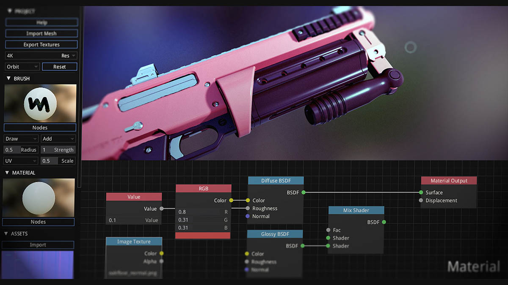
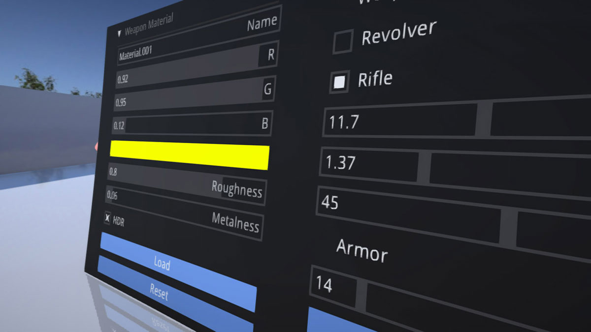

# [ZUX](https://github.com/Sondro/zux): 
[_Xperimental ZUI_](https://github.com/sondro) 

### To-Do:
|     |                                                                |
| --- | -------------------------------------------------------------- |
|`[+]`| Add textInputMulti handler                                     |
|`[+]`| Fix panel scrolling when using textInputMulti                  |

### Bugs:
|     |                                                                           |
| --- | ------------------------------------------------------------------------- |
|`[-]`| textInput backspace/delete doesn't work after spamming input              |
|`[-]`| refresh causes textInput spam on key press (html5)                        |
|     |                                                                           |
|`[-]`| file browser labels fly to the left during enter/click events (electron)  |
|`[-]`| file browser stops filling/coloring appearing black/clear                 |    
|     |                                                                           |
|`[-]`| scrollbar disappears when mouse outs                                      |    

#### Credits

[zui by Lubolenco](https://github.com/armory3d/zui)

---------------------------

Portable immediate mode UI library designed for tooling and game debug. Built with Haxe and Kha. Check out live demo at [KodeGarden](http://kodegarden.org/#e199af106a797bafa301c3956ad6f1aea7929744).



##### Getting started
- Clone into *your_kha_project/Libraries*
- Add `project.addLibrary('zui');` into *khafile.js*
``` hx
	// In init()
	var ui = new Zui({ font: myFont, khaWindowId: 0, scaleFactor: 1.0 });

	// In render()
	public function render(frame:Framebuffer) {
		var g = frame.g2;
		g.begin();
		// Draw your stuff...
		g.end();
		
		ui.begin(g);
		if (ui.window(Id.handle(), x, y, w, h, drag)) {
			if (ui.button("Hello")) {
				trace("World");
			}
		}
		ui.end();

		// Draw more stuff...
	}
```

##### Elements
``` hx
function tab(id: Handle, text: String): Bool;
function panel(id: Handle, text: String, accent = 1): Bool;
function image(image: Image): State;
function text(text: String, align = Left, bg = 0);
function textInput(id: Handle, label = ""): String;
function button(text: String, align = Center): Bool;
function check(id: Handle, text: String): Bool;
function radio(groupId: Handle, pos: Int, text: String): Bool;
function inlineRadio(id: Handle, texts: Array<String>): Int;
function combo(id: Handle, texts: Array<String>, label = ""): Int;
function slider(id: String, text: String, from: Float, to: Float, filled = false, precision = 100, displayValue = true): Float;
function tooltip(text: String);

// Formating
function row(ratios: Array<Float>);
function separator();
function indent();
function unindent();
```

Id.hx - simple macros to generate handles
``` hx
var state = ui.check(Id.handle(), "Check Box");
```

Ext.hx - prebuilt elements:
``` hx
function list(...); // See examples
function panelList(...);
function colorPicker(...);
function colorWheel(...); 
function fileBrowser(...);
```

Nodes.hx - drawing node systems
``` hx
nodes.nodeCanvas(...); // See examples
```

Canvas.hx - drawing custom layouts
``` hx
Canvas.draw(...); // See examples
```

##### Examples
Check out [examples/](https://github.com/armory3d/zui/tree/master/examples) folder. To run specific example, simply drop it's folder into [KodeStudio](https://github.com/KTXSoftware/KodeStudio/releases) and hit run. If you are having trouble compiling, clone latest [Kha](https://github.com/Kode/Kha) repository into your example folder (alongside the `khafile.js`). This will let KodeStudio pick up the most recent Kha.

##### Theming
Themes can be defined using TTheme typedef. Check zui.Themes class for example. Set ZuiOptions.theme when creating new Zui instance to overwrite default theme.

##### Snippets

**Check element for changes**
```hx
var hcombo = Id.handle();
ui.combo(hcombo, ["Item 1", "item 2"]);
if (hcombo.changed) {
	trace("Combo value changed this frame");
}
```

**Force redrawing zui window on demand**
```hx
function render(..) {
    // Get window handle
    var hwin = Id.handle();
    // Force redraw - set each frame or whenever desired
    hwin.redraws = 1;
    if (ui.window(hwin, x, y, w, h)) { ... }
}
```

**Using render targets - prevent nested begin/end calls**
```hx
g2.begin();
..
g2.end();

renderTarget.g2.begin();
..
renderTarget.g2.end();

zui.begin(); // Zui also draws to texture..
..
zui.end();

g2.begin();
..
g2.end();
```

**Using Id.handle() in a for loop**
```hx
// Id.handle() works at compile time
// Call .nest() to get unique handle per interation
for (i in 0...3) Id.handle().nest(i);
// Or use new zui.Handle() directly
```

**Set initial Id.handle() state**
```hx
var h1 = Id.handle({selected: true});
var h2 = Id.handle({position: 0});
var h3 = Id.handle({value: 1.0});
var h4 = Id.handle({text: "Text"});
```

##### Custom integration
Using the powerful render target system of Kha, it is possible to easily integrate the library into any scenario. Set ZuiOptions.autoNotifyInput to false when creating a new Zui instance. You can then manually process the input and render the resulting texture in any way you may need.
``` hx
zui.onMouseDown(button:Int, x:Int, y:Int)
zui.onMouseUp(button:Int, x:Int, y:Int)
zui.onMouseMove(x:Int, y:Int, movementX:Int, movementY:Int)
zui.onMouseWheel(delta:Int)
```


---

Inspired by [imgui](https://github.com/ocornut/imgui).

